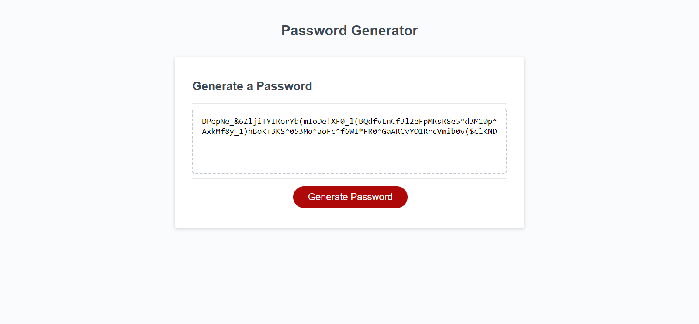

# JavaScript: Password Generator

## User story
AS AN employee with access to sensitive data
I WANT to randomly generate a password that meets certain criteria
SO THAT I can create a strong password that provides greater security

## Work Process
I used Javascript to create a random password generator which prompts the user, asking which criteria to include in password as well as password length. The application then generates a random password with said criteria for the user.

